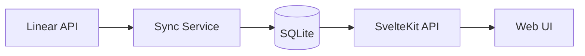

# Architecture

## Overview



## Stack

| Layer    | Technology                 |
| -------- | -------------------------- |
| Frontend | SvelteKit 5 + Tailwind CSS |
| Backend  | SvelteKit API routes       |
| Database | SQLite (bun:sqlite)        |
| External | Linear GraphQL API         |

## Directory Structure

```
src/
  routes/           # Pages and API endpoints
  lib/
    components/     # Svelte components
    stores/         # Svelte stores
    utils/          # Helper functions
  db/               # Schema and queries
  services/         # Sync and business logic
  linear/           # Linear API client

scripts/            # CLI utilities
docs/               # Documentation
```

## Data Flow

1. **Sync**: `bun run sync` fetches from Linear API
2. **Store**: Data written to SQLite with computed metrics
3. **Serve**: SvelteKit API routes query SQLite
4. **Render**: Frontend components display data

## Key Services

### Sync Service (`src/services/sync-service.ts`)

- Fetches started issues and project data from Linear
- Computes metrics (velocity, cycle time, violations)
- Supports partial sync recovery
- Progress reporting via database state

### Database (`src/db/`)

- `schema.ts` — table definitions
- `queries.ts` — CRUD operations
- `connection.ts` — singleton connection

### Linear Client (`src/linear/client.ts`)

- GraphQL queries for issues and projects
- Rate limit handling
- Pagination support

## Deployment & Storage

### Database Persistence

The application uses SQLite for data storage:

- **Development**: Database file stored as `linear-bot.db` in the project root
- **Production**: Database file stored at `/data/linear-bot.db` on a Fly.io persistent volume

The database connection (`src/db/connection.ts`) automatically selects the appropriate path based on the `NODE_ENV` environment variable.

### Fly.io Volume Configuration

In production, the SQLite database is persisted using a Fly.io volume:

- **Volume mount**: `/data`
- **Database path**: `/data/linear-bot.db`
- **Volume name**: `linear_bot_data`
- **Volume size**: 1GB (configurable)

The volume persists across deployments and machine restarts, ensuring data durability. To create the volume:

```bash
fly volumes create linear_bot_data --region iad --size 1
```

The volume mount is configured in `fly.toml`:

```toml
[[mounts]]
  source = "linear_bot_data"
  destination = "/data"
```

## Derived Data Pattern

Aggregate stats are computed during sync and stored in dedicated tables, not calculated at read time.

### Design Rationale

| Approach        | Tradeoff                           |
| --------------- | ---------------------------------- |
| Compute on read | Slow queries, repeated calculation |
| Compute on sync | Fast reads, single source of truth |

We use **compute on sync** for all derived metrics.

### Implementation

1. **Raw data**: `issues` table stores data as-is from Linear
2. **Derived tables**: `projects`, `engineers` store aggregated stats
3. **Sync flow**: After writing issues, call `computeAndStore<Entity>()` functions
4. **Frontend**: Reads derived tables directly, no aggregation

### Adding New Derived Data

To add a new entity with derived stats:

```
1. src/db/schema.ts       → Add table definition + interface
2. src/db/queries.ts      → Add upsert/get/delete functions
3. src/services/sync-service.ts → Add computeAndStore<Entity>()
4. src/services/mock-data.ts    → Add mock data generation
5. Call computeAndStore<Entity>() after issues are written
```

### Example Flow

```
Linear API
    ↓
fetchStartedIssues() → issues table (raw)
    ↓
computeAndStoreProjects() → projects table (derived)
computeAndStoreEngineers() → engineers table (derived)
    ↓
Frontend reads derived tables
```
