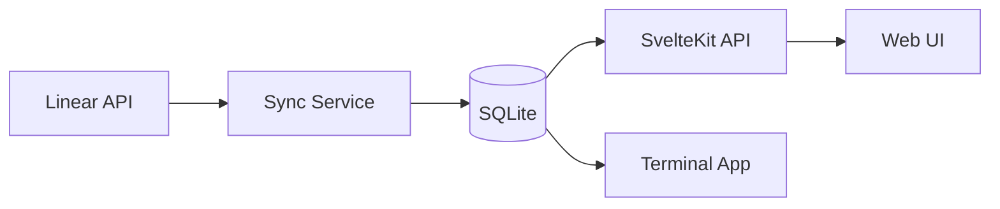

# Architecture

## Overview



## Stack

| Layer    | Technology                 |
| -------- | -------------------------- |
| Frontend | SvelteKit 5 + Tailwind CSS |
| Backend  | SvelteKit API routes       |
| Database | SQLite (bun:sqlite)        |
| External | Linear GraphQL API         |
| CLI      | Ink (React for terminals)  |

## Directory Structure

```
src/
  routes/           # Pages and API endpoints
  lib/
    components/     # Svelte components
    stores/         # Svelte stores
    utils/          # Helper functions
  db/               # Schema and queries
  services/         # Sync and business logic
  linear/           # Linear API client

terminal/           # Ink-based TUI
scripts/            # CLI utilities
docs/               # Documentation
```

## Data Flow

1. **Sync**: `bun run sync` fetches from Linear API
2. **Store**: Data written to SQLite with computed metrics
3. **Serve**: SvelteKit API routes query SQLite
4. **Render**: Frontend components display data

## Key Services

### Sync Service (`src/services/sync-service.ts`)

- Fetches started issues and project data from Linear
- Computes metrics (velocity, cycle time, violations)
- Supports partial sync recovery
- Progress reporting via database state

### Database (`src/db/`)

- `schema.ts` — table definitions
- `queries.ts` — CRUD operations
- `connection.ts` — singleton connection

### Linear Client (`src/linear/client.ts`)

- GraphQL queries for issues and projects
- Rate limit handling
- Pagination support
